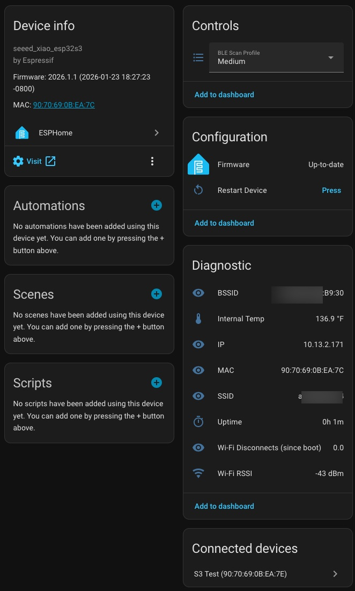
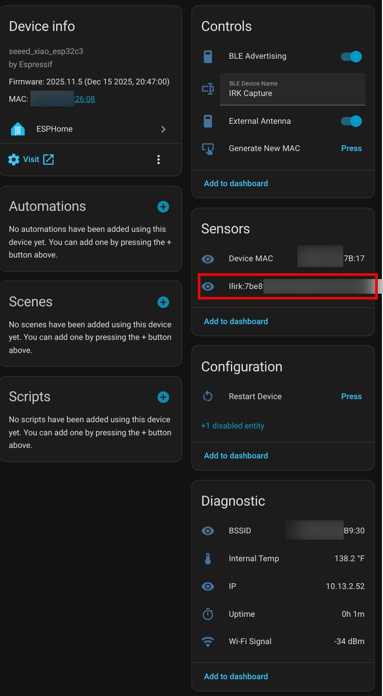

# Seeed XIAO ESP32‑S3 ESPHome Device Builder Package

This repository contains a reusable **ESPHome Device Builder package** for the Seeed XIAO ESP32‑S3 (esp32s3) boards. The project provides a shared base configuration package that can be included in device YAMLs to keep device files concise and consistent. The configuration is tailored for Home Assistant Bluetooth proxy and scanning functionality. I use it with the "Bermuda BLE Trilateration" HACS add-on for room-level presence detection.

Quick overview

- Purpose: maintain one canonical, reusable base configuration for Seeed XIAO ESP32‑S3 boards and simple device examples that include it.

- Layout:

  - `examples/` — device example YAMLs and helpers.

  - `examples/common/Seeed xiao ESP32-s3 base.yaml` — shared base configuration (board, wifi, API/OTA, sensors, BLE proxy).

  - `examples/common/Seeed xiao ESP32-s3 base IRK.yaml` — IRK capture variant base configuration.


## How to use the base package

The generic device YAML includes the ESP32-S3 base configuration via `packages` and provides substitutions:

```yaml
substitutions:
  device_name: esphomes3-garage
  friendly_name: Garage S3
  api_key: "ZmFrZWFwaWtleWZha2VleGFtcGxlZmFrZWtleQ=="
  ota_password: "ChangeMe!2025"

packages:
  device: !include "common/Seeed xiao ESP32-s3 base.yaml"
```

The base configuration uses the `${api_key}` and `${ota_password}` from your device specific YAML, uses `!secret` for Wi‑Fi values (managed by ESPHome Builder), and handles the `esphome:` section automatically.

What the base config provides:

- Board & SDK: selects `esp32s3` variant and `seeed_xiao_esp32s3` board with `esp-idf` framework.

- Boot actions: none by default (add custom on_boot actions in your device YAML if needed).

- Logger & status LED: configures serial log level (USB_SERIAL_JTAG) and board LED (GPIO21) behavior.

- API & OTA: supports encrypted API (uses `${api_key}`) and OTA (uses `${ota_password}`).

- Wi‑Fi: uses `!secret` for `wifi_ssid`, `wifi_password`, and `wifi_captive`; provides fallback captive AP settings with disconnect tracking.

- BLE: enables BLE scanning and Bluetooth proxying with configurable scan profiles:
  - **Low**: 320ms interval, 30ms window (9% duty cycle) — minimal power consumption
  - **Medium** (default): 320ms interval, 90ms window (28% duty cycle) — balanced performance
  - **High**: 320ms interval, 160ms window (50% duty cycle) — maximum presence detection accuracy
  - Profile selection persists across reboots

- Sensors: uptime, internal temperature, Wi‑Fi RSSI, Wi‑Fi info (BSSID, IP, SSID, MAC), Wi-Fi disconnects (since boot), and SNTP time.

- Restart button: allows rebooting the device from Home Assistant.

## IRK Capture Variant

This repository also includes an alternate configuration for capturing iPhone, Apple Watch, and Android BLE Identity Resolving Keys (IRKs):

- **Base config**: `examples/common/Seeed xiao ESP32-s3 base IRK.yaml` — uses ESP-IDF framework with NimBLE for IRK capture
- **Device example**: `examples/ESPHome device config S3 IRK.yaml` — minimal device configuration for IRK capture

The IRK variant provides the same base features (WiFi, sensors) but adds IRK capture functionality through the [irk-capture](https://github.com/DerekSeaman/irk-capture) external component.

**Device YAML example for IRK capture:**

```yaml
substitutions:
  device_name: esphomes3-irk
  friendly_name: IRK Capture S3
  api_key: "ZmFrZWFwaWtleWZha2VleGFtcGxlZmFrZWtleQ=="
  ota_password: "ZmFrZWFwaWtleWZha2VleGFtcGxlZmFrZWtleQ=="

packages:
  device: !include "common/Seeed xiao ESP32-s3 base IRK.yaml"
```

**Key differences from the standard base:**

- Uses **ESP-IDF framework** with NimBLE stack (native BLE support for IRK capture)
- Bluetooth proxy and BLE tracker are disabled to avoid conflicts with IRK capture component
- Includes IRK-specific text sensors, switches, and buttons
- Advertises as a BLE Heart Rate Sensor (Apple) or Keyboard (Android) to trigger pairing
- Automatically captures and publishes IRK keys during the pairing process

**How it works:**

1. Flash the device using ESPHome CLI or Device Builder
2. The device advertises as a BLE Heart Rate Sensor (configurable name)
3. Pair your iPhone, Apple Watch, or Android device with the advertised BLE device
4. The IRK is automatically captured and published to Home Assistant sensors
5. Use the captured IRKs with Home Assistant's [Private BLE Device](https://www.home-assistant.io/integrations/private_ble_device/) integration for reliable presence detection

## Using with ESPHome Device Builder

This is an **ESPHome Device Builder package** designed to work seamlessly with the ESPHome Builder tool in Home Assistant:

1. Install the ESPHome and ESPHome Device Builder add-ons from the Home Assistant Add-on Store
2. In your ESPHome configuration directory, create a `common` folder:

   ```text
   config/
   └── esphome/
       └── common/
           ├── Seeed xiao ESP32-s3 base.yaml      ← Standard BLE proxy config
           └── Seeed xiao ESP32-s3 base IRK.yaml  ← IRK capture config
   ```

3. Copy the `Seeed xiao ESP32-s3 base.yaml` file to the `config/esphome/common/` directory
   - For IRK capture functionality, use `Seeed xiao ESP32-s3 base IRK.yaml` instead (see [IRK Capture Variant](#irk-capture-variant) section)
4. Create your device YAML using the minimal structure shown above:
   - Update the `device_name` and `friendly_name` substitutions for your specific device
   - Generate new `api_key` and `ota_password` values (ESPHome Builder can generate these)
   - The file should include the base via `packages: device: !include "common/Seeed xiao ESP32-s3 base.yaml"`
5. ESPHome Builder automatically handles:
   - Wi-Fi secrets storage (no manual `secrets.yaml` needed)
   - Firmware compilation
   - Initial upload to your ESP32-S3 device
6. The device will automatically be discovered by Home Assistant

**Note:** The base configuration uses `!secret` references for Wi-Fi credentials, which ESPHome Builder manages automatically. You only need to provide the `api_key` and `ota_password` substitutions in your device YAML. To get fresh API and OTA keys, I suggest creating a new device in ESPHome Device Builder (using any hardware model), then replace all of the YAML with my device file but re-use the fresh API/OTA keys.

## Status LED Patterns

The onboard LED (GPIO21) provides visual feedback about the device state:

| Pattern | Meaning |
|---------|---------|
| Solid ON | Everything OK - WiFi connected, API connected with active client |
| Slow blink (~1Hz) | Warning - WiFi connected but API client not connected/subscribed |
| Fast blink (~2-3Hz) | Error - No WiFi connection |
| Very fast blink (~10Hz) | Critical error during boot or OTA in progress |

## ESPHome Device Page

Here's what the device looks like in Home Assistant's ESPHome integration:



The device page shows:

- **Device info**: Board type, firmware version, and MAC address
- **Controls**: BLE Scan Profile selector (Low/Medium/High) and Restart Device button
- **Configuration**: Firmware management and OTA updates
- **Diagnostic**: BSSID, internal temperature, IP address, MAC address, SSID, uptime, Wi-Fi disconnects (since boot), and Wi-Fi RSSI

## IRK Capture Device Page

Here's what the IRK capture variant looks like in Home Assistant:



The IRK capture device page shows:

- **Device info**: Board type, firmware version, and MAC address
- **Controls**: BLE Advertising toggle, BLE Device Name input, BLE Profile selector, Generate New MAC button, and Restart Device button
- **Sensors**: Device MAC (paired device address), Effective MAC (current BLE advertising address), and IRK (captured Identity Resolving Key)
- **Configuration**: Firmware management and OTA updates
- **Diagnostic**: BSSID, internal temperature, IP address, MAC address, SSID, uptime, Wi-Fi disconnects (since boot), and Wi-Fi RSSI
